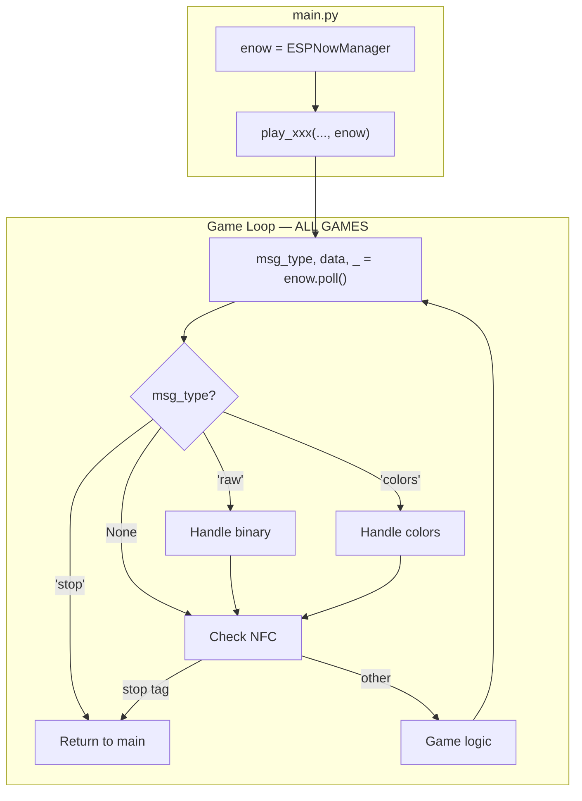

# ESP-NOW Standardization for Wand Games

## Goal

Pass `ESPNowManager` from main.py to all games. Use `poll()` consistently — it already handles both JSON and binary messages. Games keep their existing protocols (binary is faster for real-time games like freeze_dance).

## Current State

- `main.py` initializes `enow = ESPNowManager()` but does not pass it to games
- **color_quest**: Has `enow=None` param but uses raw `espnow.irecv()` instead of `enow.poll()`
- **freeze_dance**: Creates own raw espnow, uses binary protocol (`b"FD_GO"`, etc.) — keep this!
- **jumpin, cooking, melody**: NFC stop only, no ESP-NOW

## How ESPNowManager.poll() Already Works

```python
msg_type, data, mac_str = enow.poll()
```

| msg_type    | Trigger                         | data                      |
| ----------- | ------------------------------- | ------------------------- |
| `"stop"`    | `["stop"]` or `{"type":"stop"}` | list or dict              |
| `"colors"`  | `["turnred", ...]`              | list of color commands    |
| `"battery"` | `["battery"]`                   | list                      |
| `"score"`   | `{"type":"score", ...}`         | dict                      |
| `"raw"`     | **any non-JSON bytes**          | `bytes` (e.g. `b"FD_GO"`) |
| `None`      | no message                      | None                      |

**Key insight:** Binary messages return as `msg_type == "raw"` with `data` being the raw bytes. No translation needed!

## Standard Pattern (All Games)

```python
class AnyGame:
    def __init__(self, nfc, leds, buz, enow):
        self.enow = enow
        # ...

    def run(self):
        while True:
            # ── ESP-NOW (every frame) ──
            msg_type, data, _ = self.enow.poll()
            if msg_type == "stop":
                return
            # Games with other protocols also check:
            # if msg_type == "raw": ...    (binary)
            # if msg_type == "colors": ... (color list)

            # ── NFC (throttled) ──
            # ...

def play(nfc, leds, buz, accel, i2c, enow):
    try:
        AnyGame(nfc, leds, buz, enow).run()
    finally:
        leds.off()
```

**Every game uses the exact same inline pattern:**

1. `msg_type, data, _ = self.enow.poll()`
2. `if msg_type == "stop": return`
3. Handle other message types if needed

**Sending:**

- JSON: `enow.broadcast(["stop"])` or `enow.broadcast({"type": "score", ...})`
- Binary: `enow.send_raw(BROADCAST_MAC, b"FD_GO")`



## File Changes

### 1. [main.py](Bag2/Code/Wand Module/main.py) — Pass enow to games

Update all game dispatch calls (lines 467-504) to include `enow`:

```python
# Before
play_color_quest(nfc, leds, buz, accel, i2c)
play_freeze_dance(nfc, leds, buz, accel, i2c)
play_jumpin(nfc, leds, buz, accel, i2c)
play_cooking(nfc, leds, buz, accel, i2c)
play_melody(nfc, leds, buz, accel, i2c)

# After
play_color_quest(nfc, leds, buz, accel, i2c, enow)
play_freeze_dance(nfc, leds, buz, accel, i2c, enow)
play_jumpin(nfc, leds, buz, accel, i2c, enow)
play_cooking(nfc, leds, buz, accel, i2c, enow)
play_melody(nfc, leds, buz, accel, i2c, enow)
```

### 2. [color_quest.py](Bag2/Code/Wand Module/color_quest.py) — Use ESPNowManager.poll()

**Remove:**

- `espnow_init()` function (lines 286-299)
- `_parse_incoming()` function (lines 318-336)

**Replace all `enow.irecv()` with standard pattern:**

```python
# OLD:
host, msg = enow.irecv(50)
if msg:
    kind, payload = _parse_incoming(msg)
    if kind == "stop": ...
    if kind == "colors": ...

# NEW:
msg_type, data, _ = self.enow.poll()
if msg_type == "stop":
    return "stop", False
if msg_type == "colors":
    colors = [c for c in data if c in COLOR_BRIGHT]
    if colors:
        return colors, True
```

**Update signature:** `play(nfc, leds, buz, accel, i2c, enow)` (remove `=None` default)

### 3. [freeze_dance.py](Bag2/Code/Wand Module/freeze_dance.py) — Use ESPNowManager (keep binary protocol)

**Keep binary messages** — faster for real-time game:

- `MSG_GO = b"FD_GO"`, `MSG_FREEZE = b"FD_FREEZE"`, etc. — unchanged
- `poll()` returns these as `msg_type == "raw"` with `data == b"FD_GO"`

**Remove:**

- `_espnow_init()` function (lines 129-136)
- `_poll_espnow()` method — replace with inline pattern

**Update \_broadcast() to use send_raw():**

```python
def _broadcast(self, name):
    msg, state = BROADCASTS[name]
    for _ in range(BTN_SEND_REPEATS):
        self.enow.send_raw(BROADCAST_MAC, msg)
        time.sleep_ms(BTN_SEND_DELAY_MS)
    self._set_state(state)
```

**Replace `msg = self._poll_espnow()` with inline pattern:**

```python
# OLD:
msg = self._poll_espnow()
if msg == MSG_STOP or msg == b'"stop"':
    ...
if msg == MSG_GO: ...

# NEW:
msg_type, data, _ = self.enow.poll()
if msg_type == "stop":
    print("  ESP-NOW stop"); self.leds.off(); return
if msg_type == "raw":
    if data == MSG_GO and self.state != STATE_GO:
        self._set_state(STATE_GO); print("  GO")
    elif data == MSG_FREEZE and self.state != STATE_FREEZE:
        self._set_state(STATE_FREEZE); print("  FREEZE")
    # etc.
```

**Update **init**:**

```python
def __init__(self, nfc, leds, buz, accel, enow):
    self.enow = enow
    # ... rest unchanged
```

**Update play():**

```python
def play(nfc, leds, buz, accel, i2c, enow):
    try:
        FreezeDanceGame(nfc, leds, buz, accel, enow).run()
    finally:
        leds.off()
```

**Add import:**

```python
from espnow_manager import BROADCAST_MAC
```

### 4. [jumpin.py](Bag2/Code/Wand Module/jumpin.py) — Add ESP-NOW stop check

**Update **init**:**

```python
class JumpInGame:
    def __init__(self, nfc, leds, buz, enow):
        self.nfc = nfc
        self.leds = leds
        self.buz = buz
        self.enow = enow
        self.np = leds.np
        self.btn = Pin(BUTTON_PIN, Pin.IN, Pin.PULL_UP)
        self._frame = 0
```

**Update run() with inline pattern:**

```python
def run(self):
    while True:
        # ── ESP-NOW ──
        msg_type, _, _ = self.enow.poll()
        if msg_type == "stop":
            print("  ESP-NOW stop")
            return

        # ── NFC (throttled) ──
        if self._frame % NFC_POLL_INTERVAL == 0:
            try:
                text, uid = _read_tag_text(self.nfc)
                if text == "stop":
                    print("  STOP tag detected")
                    return
            except Exception:
                pass

        # ── Game logic ──
        ...
        self._frame += 1
```

**Update play():**

```python
def play(nfc, leds, buz, accel, i2c, enow):
    buz.beep(523, 100)
    print("\n  === BUTTON BLINK MODE ===")
    try:
        JumpInGame(nfc, leds, buz, enow).run()
    finally:
        leds.off()
        print("\n  === RETURNING TO PROGRAMMING MODE ===\n")
```

### 5. [cooking.py](Bag2/Code/Wand Module/cooking.py) — Add ESP-NOW stop check

**Update **init**:**

```python
class CookingGame:
    def __init__(self, nfc, leds, buz, enow):
        self.nfc = nfc
        self.leds = leds
        self.buz = buz
        self.enow = enow
        # ... rest unchanged
```

**Add ESP-NOW check at top of run() loop:**

```python
def run(self):
    while True:
        # ── ESP-NOW ──
        msg_type, _, _ = self.enow.poll()
        if msg_type == "stop":
            print("  ESP-NOW stop")
            return

        # ── DISPLAY UPDATE ──
        # ... existing code
```

**Update play():**

```python
def play(nfc, leds, buz, accel, i2c, enow):
    _play(buz, 'enter')
    print("\n  === COOKING GAME ===")
    try:
        CookingGame(nfc, leds, buz, enow).run()
    finally:
        _play(buz, 'exit')
        leds.off()
        print("\n  === RETURNING TO PROGRAMMING MODE ===\n")
```

### 6. [melody.py](Bag2/Code/Wand Module/melody.py) — Add ESP-NOW stop check

**Update **init**:**

```python
class MelodyGame:
    def __init__(self, nfc, leds, buz, enow):
        self.nfc = nfc
        self.leds = leds
        self.buz = buz
        self.enow = enow
        # ... rest unchanged
```

**Add ESP-NOW check at top of run() loop:**

```python
def run(self):
    while True:
        # ── ESP-NOW ──
        msg_type, _, _ = self.enow.poll()
        if msg_type == "stop":
            print("  ESP-NOW stop")
            return

        # ── DISPLAY UPDATE ──
        # ... existing code
```

**Update play():**

```python
def play(nfc, leds, buz, accel, i2c, enow):
    _play(buz, 'enter')
    leds.solid(0, 20, 20)
    time.sleep_ms(200)
    leds.off()
    print("\n  === MELODY BUILDER ===")
    try:
        MelodyGame(nfc, leds, buz, enow).run()
    finally:
        _play(buz, 'exit')
        leds.off()
        print("\n  === RETURNING TO PROGRAMMING MODE ===\n")
```

### 7. [GAME_AUTHORING_GUIDE.md](Bag2/Code/Wand Module/GAME_AUTHORING_GUIDE.md) — Update template

Update template to show standard pattern:

```python
class YourGame:
    def __init__(self, nfc, leds, buz, enow):
        self.nfc = nfc
        self.leds = leds
        self.buz = buz
        self.enow = enow
        self._frame = 0

    def run(self):
        while True:
            # ── ESP-NOW ──
            msg_type, data, _ = self.enow.poll()
            if msg_type == "stop":
                return

            # ── NFC (throttled) ──
            if self._frame % NFC_POLL_INTERVAL == 0:
                # check stop tag...

            # ── Game logic ──
            self._frame += 1

def play(nfc, leds, buz, accel, i2c, enow):
    try:
        YourGame(nfc, leds, buz, enow).run()
    finally:
        leds.off()
```

Add section explaining:

- `enow` is `ESPNowManager` passed from main.py
- `poll()` returns `(msg_type, data, mac_str)`
- `msg_type == "stop"` → station broadcast, exit game
- `msg_type == "colors"` → color list in `data`
- `msg_type == "raw"` → binary message, `data` is bytes

### 8. [readme.md](Bag2/Code/Wand Module/readme.md) — Document behavior

Update "Games are separate modules" section to note that games respond to both NFC stop tags and ESP-NOW stop broadcasts.

## Testing

- Station broadcasts `["stop"]` → all games exit cleanly
- freeze_dance binary protocol (`b"FD_GO"`, etc.) still works via `msg_type == "raw"`
- Standalone `main()` creates own ESPNowManager

## Summary

**Receive:** Always use `enow.poll()`:

- `msg_type == "stop"` → station stop broadcast (JSON)
- `msg_type == "raw"` → binary message, `data` is bytes
- `msg_type == "colors"` → color list from station

**Send:**

- JSON: `enow.broadcast(data)`
- Binary: `enow.send_raw(BROADCAST_MAC, b"FD_GO")`

**No changes needed to ESPNowManager** — it already handles everything.
