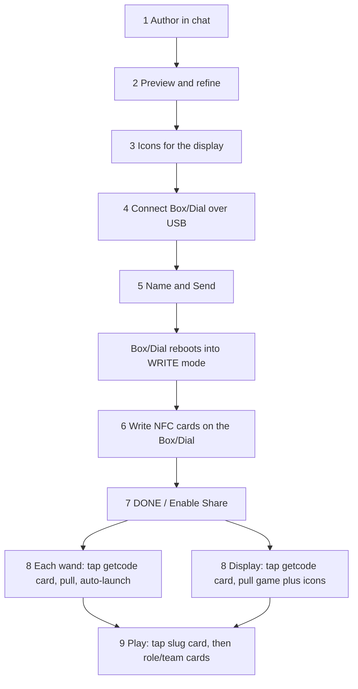

# Task analysis: "Start from scratch" to a game playable on many wands, an icon display and game-specific NFC tags

Scope: Bag3. A teacher authors a game in ChatBroadcast, sends it to a Broadcast Box or Dial, and the
game then reaches wands, an Icon Display and NFC cards. Derived from code reading on branch
`Chat_to_Tap_Doggle` (2026-10-06); nothing here was run on hardware unless stated.

Paths are relative to `Bag3/Code/BroadcastCode/`. `CB` = `ChatBroadcast`.

## 1. Actors and devices

| Actor / device | Role in the task |
|---|---|
| Teacher | Authors the game, runs the Box/Dial, writes cards, taps each device |
| Children | Play; pick roles/teams by tapping cards |
| ChatBroadcast (Chrome/Edge, Web Serial) | Chat authoring, preview, USB sender |
| Broadcast Box (StickS3) / Dial (M5 Dial 2) | Receives the game over USB, writes NFC cards, then serves it over its own WiFi AP |
| Wand (`MockWand`) | Pulls the game, plays it, reads cards |
| Icon Display (16x16, XIAO C6) | Pulls the display game and its icons, shows icons during play |
| NFC cards (NTAG / Ultralight / MIFARE Classic) | Plain lowercase NDEF text; no game id on the card |

The AP and the NFC reader on the Box/Dial are never on at the same time, so card writing and
serving are separate phases.

## 2. Overview

Phases 1-5 happen in the browser. Phases 6-9 are physical and repeat per card or per device.

## 3. Task flow

Legend: **[D]** decision, **[M]** manual step outside the app, **[F]** feedback the user sees.

### Phase 1. Author in chat (browser, no hardware)

1. Unlock with the magic code (modal on first load; chat re-checks it on every send).
2. Splash, click **Start from scratch**. If there is unsaved work: **Save & Continue / Discard / Cancel**.
   The workspace opens empty with a "Help me make a game" pill and four idea chips.
3. **[D]** Input path: free text; an idea chip (fills the box, does not send); or the guided pill
   (three tap questions: which devices, how children play, what happens).
   The device answer decides whether the model emits wand, display and/or Splat files.
4. The model replies with fenced code blocks tagged `[DEVICE: wand|icon|splat]`, an optional
   `[GAME_NAME: ...]`, an `[NFC_CARDS: ...]` list and a "Cards you need" section.
   - A block replaces the editor only if it passes the `play()` signature check; otherwise the chat says
     "your game was not changed".
   - **[F]** "Code updated (vN)". Display/Splat tabs appear once those roles have code.
   - A wand file over 32,000 bytes still loads but warns.
5. **[D]** Iterate in chat or accept.

Entry alternatives: **Browse examples** then **Remix this in chat** or **Use as-is, then send**;
**My saved games**.

### Phase 2. Preview and refine

1. Wand tab: `<wand-sim>` (Pyodide, needs internet). **[F]** "Play it" banner after new code.
   Multi-wand interaction is not simulated ("it needs two wands talking").
2. Display tab: static icon viewer (starting icon, icon picker, brightness). Game logic does not run.
3. Splat tab: no preview.
4. Optional: **View code** to hand-edit. Hand edits do not refresh the preview or mark the game dirty.
5. Name the game: chat marker, title-bar pencil, or the field in the send overlay.
6. **Save** stores the game in browser `localStorage`. Each Save creates a new library entry.
   A game with no wand code cannot be saved or sent.

### Phase 3. Icons for the display (only if the game has a display file)

1. The model may only name icons from the list the app gives it (85 shipped, plus starter palette and
   this game's own edits).
2. **[D]** Use shipped icons as-is, or **Edit icons** (Display tab only) to edit or create one.
   Save with **Save game icon**; the edit belongs to this game only, in the browser.
3. An authored icon reaches the display only if the display code names it (`read_icon("name")`).
   The UI does not say this.
4. **[D]** Editing a shipped name (for example `apple`) versus a new name: on the display, pulled icons
   are written to one flat `icons/` folder, so a same-named icon overwrites that name for every game
   on that display until the other game is pulled again.

### Phase 4. Connect the Box/Dial

1. **[M]** USB data cable into the Box or Dial. One browser tab can hold the port.
2. **Connect** > **Broadcast Box / Dial** > pick the port.
3. **[F]** Header chip: `connecting...`, `waking up...`, then live ("Box ready" / "Dial ready").
   Failure chips: `not a Broadcast device`, `needs a nudge`, `isn't answering` (shows a Restart button),
   `lost the Box`.
4. **[D]** Choosing **Wand** instead sends only the wand file straight to one wand; no tags, display or
   Splat file, no cards. That path does not scale to many wands.

### Phase 5. Send

1. **Send to Box/Dial** is enabled only when the link is live and the wand editor has code.
2. Overlay "Name this game". **[F]** Requirements rows: "at least 1 wand" (always 1), "N NFC tags"
   (a count, not names), a station count for Splat, and a warning if the tag list could not be fully
   resolved.
3. **[D]** Checks that can block the send, in order:
   - Name: empty, reserved (built-in games/commands), longer than 16 characters after slugging,
     ends in `_icon` or `_splat`.
   - Duplicate on the device: the button becomes **Replace existing game**; click again.
   - Display file: `play(nfc, panel, enow)` signature; every `read_icon("literal")` must exist.
   - Splat file: signature and action names.
   - Wand file: signature and size at most 32,000 bytes.
4. Upload, one raw-REPL session, then one soft reset. Files written to `/flash/games/`:
   `<slug>.py`, `<slug>.tags.json`, `<slug>_icon.py`, `<slug>_icons/<name>.py` (one per named icon),
   `<slug>_splat.py`.
5. **[F]** Progress bar; then "`<name>` is on the Box! The Box will restart now"; auto-closes after 5 s;
   chip shows `restarting...` and the app reconnects (20 s limit).
6. Failure: overlay stays open with a toast; the user retries. Cancel is hidden while sending.
7. The same wand file goes to every wand. There is no per-wand or per-role code; roles are picked at
   runtime by cards.

### Phase 6. Write the NFC cards (on the Box/Dial itself)

The app does not drive or confirm card writing. After the reboot the device is in WRITE mode.

Cards the teacher needs (names come from `<slug>.tags.json`, derived from the game's `COMMANDS` set,
else the `[NFC_CARDS]` marker, else a `note_*` sniff):

| Card text | Purpose | Count |
|---|---|---|
| `getcode:<slug>@<hostid>` | Pickup: wand/display pulls the game from this Box/Dial | 1 (reusable by every device) |
| `<slug>` | Play: launches the installed game | 1 (reusable) |
| Game cards (`teamgreen`, `note_c`, ...) | Used inside the running game | 0 to about 11 |
| `stop`, `battery` | Utilities, always offered, not counted in the game's list | optional |

Steps per card:
1. **[M]** On the device, open the game's group, pick a row (Box: BtnA acts, BtnB scrolls; Dial: rotate and press).
2. **[M]** Present a blank card. **[F]** "Hold Card on Screen" / "Tap Tag Now", then "Hold Card Steady", then
   "N Written So Far" with a beep.
3. **[D]** Card already holds the same text: "No Change Needed". Different text: overwritten silently,
   with no confirmation. **Read Card** shows what a card holds.
4. Failure: red "Write Failed", fail beep, the same row re-arms; hold the card still and retry.
5. Repeat for every row. There is no auto-advance.
6. **[F]** In the browser, My Box > expand the game shows each tag as `N×` or `not written`.
7. Labelling and sorting the physical cards is manual; nothing prints or labels them.

Card limits: 54 bytes of text, lowercase only, 7-byte UIDs supported as of commit `4bbe8a1`.
The NFC Station is not connected to ChatBroadcast; the Box/Dial is the writing path.

### Phase 7. Start sharing

1. **[M]** Select **DONE** (Box) / **Enable Share** (Dial). The AP `SP-FILEPUSH-<id>` comes up and the
   reader goes off.
2. **[F]** "Sharing `<id>`", "Pickups: N Total", "Hold Button to Exit". If there is no game: "No Game to Serve".
3. Any later Send reboots the device out of SERVE; the teacher presses DONE again. The app does not say so.

### Phase 8. Each device gets the game

Wand (repeat per wand; the Box serves up to 4 clients at a time):
1. **[M]** Tap the `getcode:<slug>@<id>` card on the wand. **[F]** blue-dim light and beep; the wand
   writes a pull flag and reboots (WiFi join only works before ESP-NOW has started).
2. After reboot: blue wifi bars while scanning/joining, cyan bar filling during transfer, hash and
   compile check, then a green check and beep. The wand reboots again and auto-launches the game once.
3. About 31 s per wand end to end (measured, single wand).
4. **[D]** Failure glyphs, no automatic retry; the teacher re-taps:

| Glyph | Meaning |
|---|---|
| Red wifi bars | Box/Dial is not sharing |
| Orange wifi bars | AP visible, join failed; or no game/role file for this slug and hubtype |
| Red X | Transfer broke, or the compile check rejected the file (shown the same way) |

Icon Display:
1. **[M]** Tap the same `getcode:<slug>@<id>` card on the display. It reboots and pulls the display file
   `<slug>_icon.py` and then up to 64 icon files. It auto-launches the game.
2. **[F]** Boot-screen stages, a blue fill during the pull, a green check on success.
3. A failed or refused icon does not fail the game; the game still launches and the failure appears
   only in the serial log. A game that reads a missing icon raises an error.

Splat Companion follows the same pull model with `<slug>_splat.py`.

**[D]** Confirming each device has the game: the Box/Dial shows only a cumulative pickup counter and a
live "N Wands" count while pulling; My Box shows `N× handed out` per game. There is no per-wand roster.
The teacher checks each wand for the green check.

### Phase 9. Play

1. First launch is automatic after a pull. Later, **[M]** tap `<slug>` on each wand; the Box does not
   start every wand at once.
2. **[M]** Children tap team/role cards (`teamgreen`, `caller`, ...). Wands exchange state over ESP-NOW.
3. The display shows icons driven by its game code in response to ESP-NOW messages from wands.
4. Cards from other games, or text not in the running game's `COMMANDS`, are ignored; a `<slug>` card
   for a game that is not installed on that wand gives the reject beep when idle.
5. Stop: `stop` card on each wand, an ESP-NOW `stop`, or tap a built-in game card.
6. Leave SERVE: hold the Box/Dial button for 1 s.

## 4. Where the time and effort go

| Phase | Teacher effort | Scales with N wands? |
|---|---|---|
| 1-3 Author, preview, icons | Conversational; minutes | No |
| 4-5 Connect, send | Few clicks; send plus reboot is seconds | No |
| 6 Write cards | One tap-and-hold per card; the most hands-on authoring step | No (cards are reusable) |
| 7 Share | One press | No |
| 8 Pull | One tap plus about 30 s per wand; at most 4 at once | Yes, linear in batches of 4 |
| 9 Start | One tap per wand | Yes |

## 5. Friction points, risks and gaps (current behavior)

Ordered by where a teacher is most likely to be stuck.

1. **Card writing has no guidance in the app.** The send overlay shows a tag count only; names appear
   in the chat's "Cards you need" section and in My Box. `showTagChecklist`, `#tag-checklist-overlay`
   and `#sent-banner` ("Hold a card on the device to write it") exist but are never shown, while
   `knowledge/policy.md` and `knowledge/troubleshooting.md` tell the model the app says that.
2. **Sharing must be re-enabled after every Send**, and nothing in the app says so. A wand tapped
   before DONE shows red wifi bars.
3. **No retry on failed pulls** (`MAX_ATTEMPTS = 1`). Every failure is a manual re-tap.
4. **Compile rejections look like transfer failures.** The wand's compile limit is between about 36 and
   40 KB; the app's guard is 32,000 bytes for the wand file only, with no limit on display or Splat files.
5. **Silent icon-leg failures.** The send succeeds and the display launches the game, but a failed icon
   transfer is visible only in serial logs.
6. **Icon store is per game in the browser and on the Box, but flat on the display.** Same-named custom
   icons from different games overwrite each other on a display; nothing is deleted.
7. **Icon validation covers `read_icon("literal")` only.** Names held in tables or variables that are
   not already in the library are not caught, and the preview note ("cannot be sent until they do")
   overstates this. Authored icons the code does not name are not uploaded.
8. **Display-only or Splat-only games cannot be saved or sent**, although the guided flow offers
   "The Splat on its own".
9. **Multiple wands need one tap each and are capped at 4 concurrent pulls.** What a fifth wand sees is
   undocumented. Concurrent multi-wand pulls were observed to stall a Dial once (cause unknown).
10. **No per-wand confirmation.** Counts only.
11. **Tag derivation can be wrong silently.** An unresolved `COMMANDS` expression yields a short
    `tags.json`; the only signal is a warning row in the send overlay.
12. **Card writes overwrite silently**; there is no confirm step.
13. **Display game files and `_icons/` directories are orphaned** by Box delete/clear.
14. **Save always creates a new entry** although the button title says it updates; hand edits are not
    versioned and do not set the unsaved flag.
15. **Use as-is after other work** does not reset roles or chat, so leftover display/Splat code can be sent along.
16. **Hardware status.** The Box (StickS3) pull is recorded as unproven on hardware since 2026-09-02;
    Dial pulls have been exercised. The Icon Display's card reader has never read a tag on hardware.

## 6. Documentation inconsistencies found while tracing

- `Wand Module/readme.md` and `Wand Module/GAME_AUTHORING_GUIDE.md` describe 4-byte opcode cards and no
  pull flow; the wand that receives ChatBroadcast games is `MockWand/`, which reads NDEF text cards.
- `BroadcastCode/README.md` is a stale plan ("not yet implemented"); several docs use
  `BroadcastBox/...` paths that are now `BroadcastCode/...`.
- `docs_and_design/2026-09-30-known-issues.md` and `ChatBroadcast/9-4-known_issues.md` say ChatBroadcast
  has no size check; `upload.js` enforces 32,000 bytes for the wand file.
- `IconDisplay/README.md` says a game may name only icons in `defaultIcons.js`; the check allows default,
  starter and this game's icons. `iconLibrary.js` comment says games are isolated on the device; that
  holds on the Box only.
- `MockWand/README.md` describes a 5 s boot grace and a 10 s pull budget; code and
  `DEVICE_ONBOARDING_SURFACES.md` say no grace.
- `Stations/NFC Station/docs/plan.md` says ChatBroadcast can push a catalog to the Station; no such code exists.
- `Stations/Icon Display Station/readme.md` and `tools/sync_icons.py` refer to a `BroadcastBox/IconDisplay`
  path and "28 icons"; the source is `BroadcastCode/IconDisplay/icons/` with 85 icons. The Station tree
  holds 63 of them, byte-identical to the same names. `sync_icons.py --check` reports no drift for
  `defaultIcons.js`.
- `Simulator/vendor/lib/game_tags.py` and the Bag3 `Wand Module/lib/game_tags.py` differ from
  `MockWand/lib/game_tags.py` (for example the Simulator copy lacks `goalrace`).

## 7. Not confirmed

- Whether the 5 s auto-close success overlay is followed by a "disconnected" toast on a normal send
  (code suggests the `close` handler may raise it).
- The display's behavior if `play()` raises on a missing icon (`main.py` has no wrapper around `play`).
- A fifth simultaneous wand.
- Whether Box-served pulls to a real wand have been re-verified since 2026-09-02.
