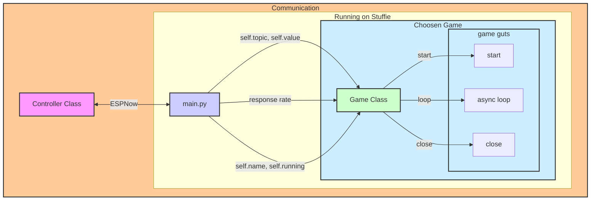

## Jenn's app
You can use a controller or control it from a webpage on your PC (as long as you have an ESP connected over serial to the PC - it needs to talk ESPNow).  You can go to her page [here](https://jenncross.pyscriptapps.com/playground-app-front-end)

## Playground code

Things seem to work.  Move the folder structure down on to a plushie - then replace main.py with the one in games - and then run this code on a different ESP to change the game.

```python
import utilities.now as espnow
import time, json

def my_callback(msg, mac, rssi):
    print(mac, msg, rssi)
    n.publish(msg, mac)

n = espnow.Now(my_callback)
n.connect()
print(n.wifi.config('mac'))

test = json.dumps({'topic':'/game', 'value':1})
stop = json.dumps({'topic':'/game', 'value':-1})

n.publish(test)
```


## Stuffie Game Ideas for December 8/9/10:
1. find the plushie --- hot and cold
1. find the note --- rotate to note or click to "pick up the note", ---> each stuffie is assigned a note "bell choir"
1. shake to fill the color bar in random colors
1. counting jumps (taps) .... using pips to show the count of taps (up to 6)
1. if you can hear me clap, one person presses a button. ..... everyone in a certain range gets a vibration/buzz. If you feel a buzz take a step forward.

## How it all works


Possible ESP topics are:
1. "/game" defines the game number you want to start (main.py will stop the old one and start the new number)
2. "/gem" defines the mac address of the hidden gem for hot/cold
3. "/ping" is a simple ping to give the game guts an rssi strength
4. Everything else is put in the '/notify' topic (in main).

General hints on debugging:
1. main.py 
    a. sets up the WiFi/NOW
    b. sets up all utilities (motor/btn/buzzer in utilities, battery/accel in i2c_bus and LEDs in lights
    c. initializes all games (runs the def __init__, passing all the stuffie parameters)
    d. runs the appropriate game (change the game when requested to do so)
    e. appends anything that comes over the NOW on to the queue
    f. execute everything on the queue

2. Game class
    a. runs game-defined start()
    b. def run() sends out the battery level and runs def loop() until main.running is false (from Stuffie class)
    c. closes everything up.
    
3. The Game
    a. define your name and link to plushie class
    b. defines your start(), run(), and close() that are unique to each game.
    
